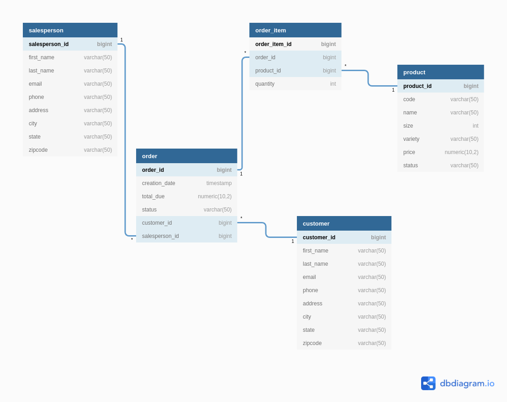

# Introduction

This app performs queries on a PostgresSQL database using JDBC. JDBC (Java Database Connectivity) is a standard 
API for accessing databases. the database stores information about customers, products, orders , and salesperson. 
The CRUD operations are implemented using the Data Access Objects (DAO) and Data Transfer Objects (DTO) pattern.

The project is built using Java, the Maven project management system, PostgresSQL (running on a docker container),
and the JDBC API.

# Implementaiton
## ER Diagram
ER diagram

  

## Design Patterns

This app uses the `DAO pattern` to access the database. The DAO pattern is a software design pattern that defines 
the interface for accessing objects in a database. The DAO pattern is used to separate the application logic from
the database. 

The `repository pattern` works in a similar way. It allows searching for a specific type of object in the database as
well store them. It only handles one type of object at a time (database persistence).

# Test

We tested the app manually using the `sql` folder. It contains all the SQL scripts that are used to populate 
the database. We also performed some sample queries to test the app.