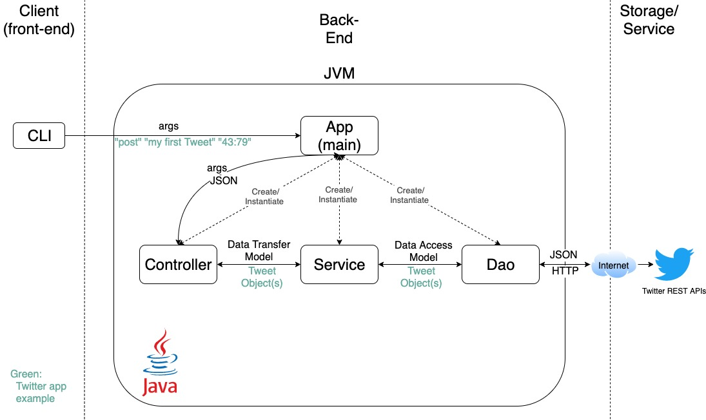

# Introduction

The purpose of this project is to create a Java application (Command Line Interface) that can create, read and delete tweets from the CLI using Twitter REST API.
The Java  app builds the URI required and sends HTTP requests to the API using Apache HTTP components and Signpost 0auth library. The response is return in JSON format.
This app is designed following the MVC design pattern consisting of a Model layer, Service layer and a DAO layer. The Model layer is responsible for handling 
the data and the Service layer is responsible for handling the business logic. The DAO layer is responsible for handling the persistence of the data.
This app is deployed on Docker Hub and is available to pull as an image. 
The project is built using :
- Java 11
- Maven
- JUnit 5 & Mockito
- Docker
- Twitter REST API

# Quick Start

## Environment variables
The following environment variables are required to run the application:
- `TWITTER_CONSUMER_KEY` - Twitter API key
- `TWITTER_CONSUMER_SECRET` - Twitter API secret
- `TWITTER_ACCESS_TOKEN` - Twitter API access token
- `TWITTER_ACCESS_TOKEN_SECRET` - Twitter API access token secret

## Usage
If you want to use the application with Docker, you can use the [image](https://hub.docker.com/r/salihou/twitter-app/) on Docker Hub.
```
docker pull salihou/twitter-app
```
1. Run the application:
```
docker run --rm \
-e TWITTER_CONSUMER_KEY=<your-consumer-key> \
-e TWITTER_CONSUMER_SECRET=<your-consumer-secret> \
-e TWITTER_ACCESS_TOKEN=<your-access-token> \
-e TWITTER_ACCESS_TOKEN_SECRET=<your-access-token-secret> \
javatwitter/twitter-rest-api-app post|show|delete
```

# Design

## Diagram
<div align="center">
<p align="center" style="width:100%;">
  
</p>
</div>

## Model
The model use a simplified version of the Twitter JSON object.
```markdown
{
    "created_at": ,
    "id":,
    "id_str":,
    "text":,
    "entities": {
        "hashtags": [],
        "user_mentions": []
    },
    "coordinates":,
    "retweet_count":,
    "favorite_count":,
    "favorited",
    "retweeted"  
}
```

# Test
Several unit and integration tests are provided to verify the correctness of the application. The tests are based on the [JUnit 5](https://junit.org/) and [Mockito](https://site.mockito.org/) libraries.

# Deployment
The application is deployed on Docker Hub by creating a Docker image. The image is available [here](https://hub.docker.com/r/salihou/twitter-app/).