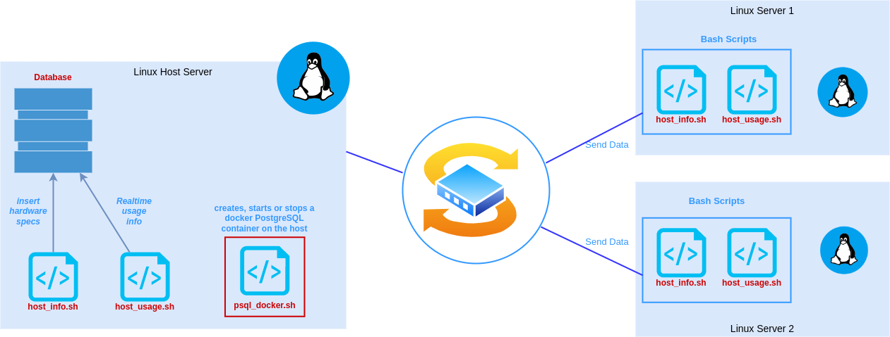

# Linux Cluster Monitoring Agent

## Introduction

The purpose of this project is to design and implement a cluster that will help the Jarvis Linux Cluster Administration team to manage multiple Linux clusters running on CENTOS 7.
This project is going to allow the LCA to keep track of each node’s hardware characteristics and monitor resource utilization in real time saved in a relational database management system. This project is built using Linux command lines, Bash scripts, PostgreSQL, Docker and Git

## Table of contents

- [Introduction](#introduction)
- [Quick Start](#quick-start)
- [Implemenation](#implemenation)
  - [Architecture](#architecture)
  - [Scripts](#scripts)
  - [Database Modeling](#database-modeling)
- [Test](#test)
- [Deployment](#deployment)
- [Improvements](#improvements)
- [Author](#author)

## Quick Start

- ### Scripts usage

```
./scripts/psql_docker.sh start|stop|create [db_username] [db_password]

# example : create the container
./scripts/psql_docker.sh create postgres password

# example :  starting the container
./scripts/psql_docker.sh start postgres password
```

- ### Creating a database

```
psql -h localhost -p 5432 -U postgres -W -c "CREATE DATABASE db_name;"

# Database initialization : Creating tables using ddl.sql
psql -h localhost -p 5432 -U postgres -d [db_name] -f sql/ddl.sql

# example : psql -h localhost -p 5432 -U postgres -d host_agent -f sql/ddl.sql
```

- ### Collect and insert hardware specs data into the psql database using `host_info.sh`

```
./scripts/host_info.sh localhost 5432 host_agent postgres password
```

- ### Collect and insert server usage data into the psql database using `host_usage.sh`

```
./scripts/host_usage.sh localhost 5432 host_agent postgres password
```

- ### Execute `host_usage.sh` every minute, so it collects data continuously.

```
# edit crontab jobs
crontab -e

# add to crontab and use path to host_usage.sh
* * * * * bash [/path_to_host_usage/host_usage.sh] localhost 5432 host_agent postgres password > /tmp/host_usage.log
```

## Implemenation

- ### Architecture

<div align="center">
<p align="center" style="width:60%;">
  
</p>
</div>

- ### Scripts

- ### Database Modeling

## Test

## Deployment

## Improvements

## Author

- Website - [Saliou](https://salihou.netlify.app/)
- Linkedin - [@Saliou](https://www.linkedin.com/in/saliou-diop-527741112/)
